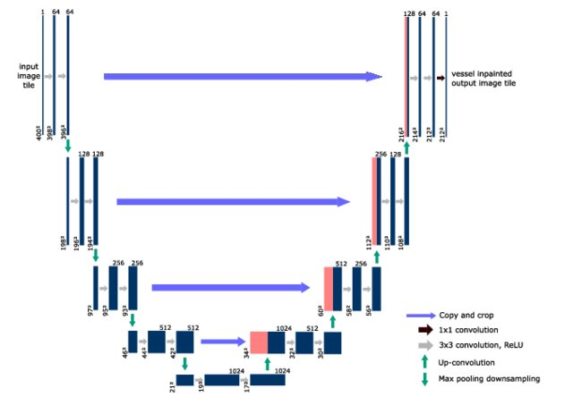
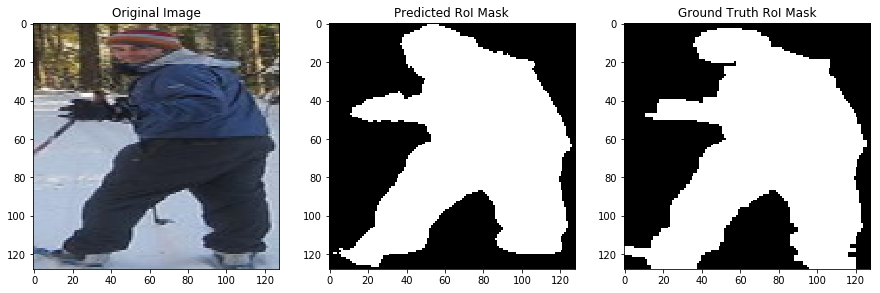
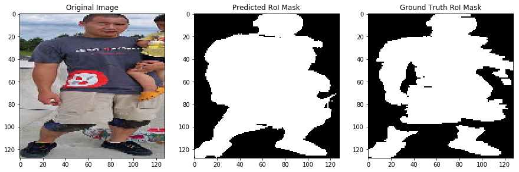
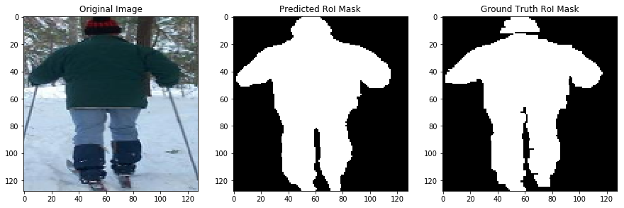
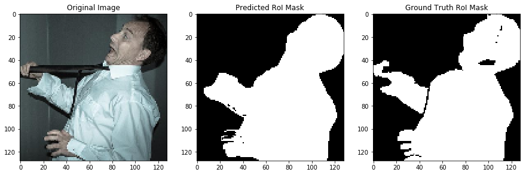
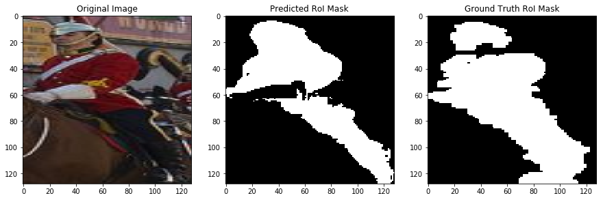
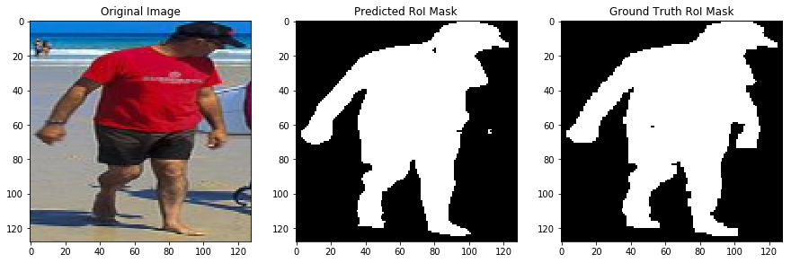
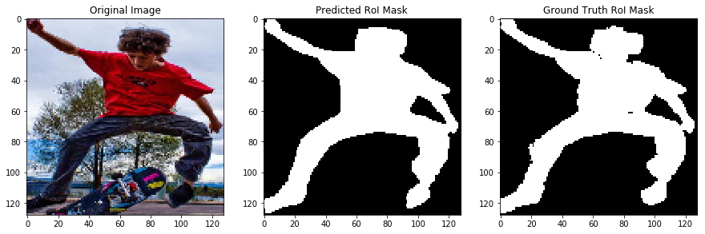
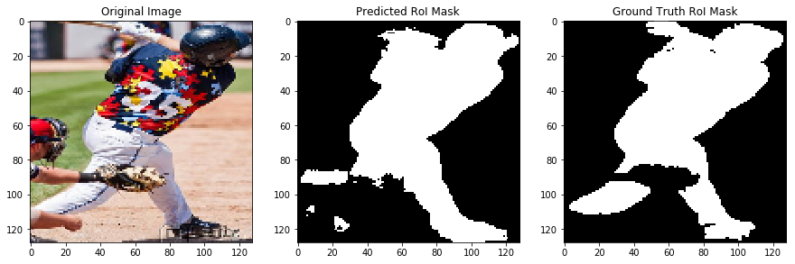
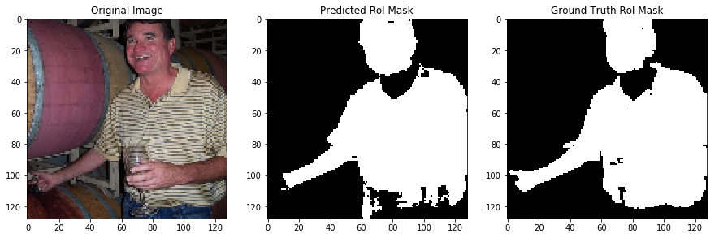

# Single-human Semantic Segmentation 
Single-human Semantic Segmentation with Unet on LIP dataset.

 &nbsp; | Details
 :-: | :-----:
 **Abstract** | Will be updated
 **Network** |  
 **Results** |      
 **Dataset** | **[LIP Dataset](http://www.sysu-hcp.net/lip/)** This dataset is a new large-scale dataset focusing on semantic understanding of person. The dataset is an order of magnitude larger and more challenge than similar previous attempts that contains 50,000 images with elaborated pixel-wise annotations with 19 semantic human part labels and 2D human poses with 16 key points. The images collected from the real-world scenarios contain human appearing with challenging poses and views, heavily occlusions, various appearances and low-resolutions. This challenge and benchmark are fully supported by the Human-Cyber-Physical Intelligence Integration Lab of Sun Yat-sen University.

## References
